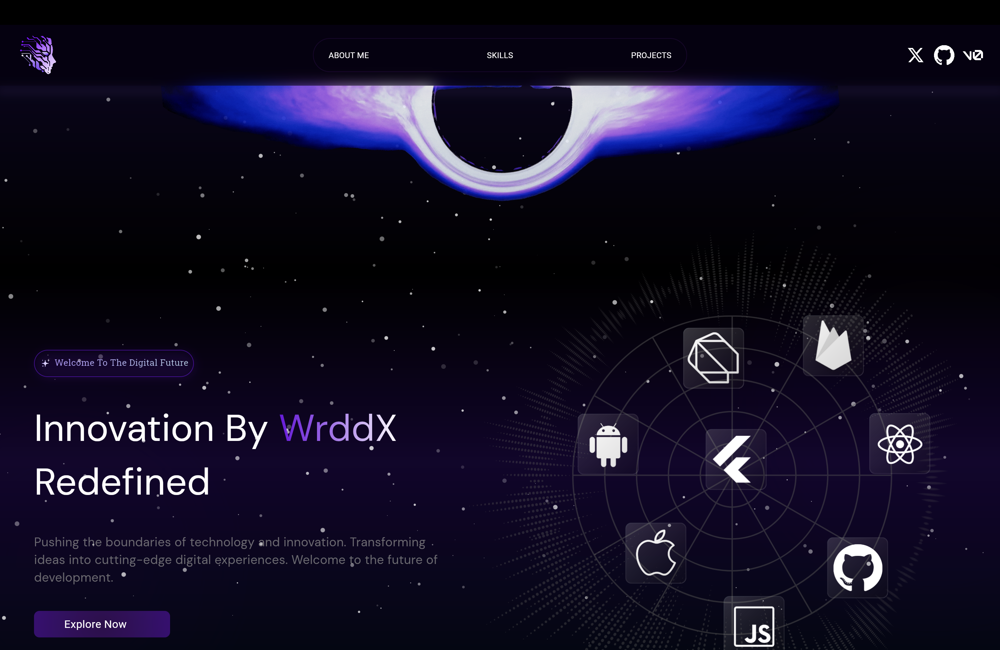

# WrddFolio - Flutter Portfolio Website

A modern, responsive, and visually stunning portfolio website built with Flutter Web, featuring space-themed design elements, interactive components, and seamless responsiveness across all device sizes.
(Personal Note: "Nav Bar Centering")

## Features

✨ **Immersive User Experience**

- Space-themed animated background
- Smooth scrolling and transitions
- Interactive hover effects
- Custom loader screen
- Responsive design for all devices

📱 **Interactive iPhone Mockup**

- Functional app icons
- Social media links
- Direct contact integrations
- Visual representation of mobile development skills

💪 **Skills Showcase**

- Dynamic skills presentation
- Technology icons with hover effects
- Categorized skill representation
- Visual tech stack display

📂 **Project Gallery**

- Detailed project cards
- Technologies used indicators
- Project descriptions
- Links to live demos/repositories

👨‍💻 **Personal Introduction**

- Professional summary
- Career highlights
- Educational background
- Professional goals

🔗 **Integrated Social Connections**

- GitHub integration
- LinkedIn profile link
- X (Twitter) connection
- Direct WhatsApp contact

## Technical Stack

### Frontend

- Flutter Web for cross-platform development
- GetX for state management
- Custom widgets and animations
- Responsive design system
- Interactive UI components

### Design & Styling

- Custom gradients and animations
- Space-themed visual elements
- Responsive layout using custom helper classes
- Dynamic sizing and positioning

## Getting Started

## Portfolio Demo

<div align="center">
  
</div>

### Prerequisites

- Flutter (latest version)
- Dart SDK
- Web browser
- Git

### Installation

1. Clone the repository

```bash
git clone https://github.com/joewrdd/wrddfolio_flutter.git
```

2. Install dependencies

```bash
cd wrddfolio_flutter
flutter pub get
```

3. Run the app in debug mode

```bash
flutter run -d chrome
```

4. Build for production

```bash
flutter build web
```

## Project Structure

```
lib/
├── common/              # Shared widgets & styles
│   ├── styles/          # Gradient text & images
│   └── widgets/         # Reusable UI components
├── main/                # Main application code
│   ├── controllers/     # GetX controllers
│   ├── models/          # Data models
│   └── ui/              # UI components
│       ├── appbar/      # Custom app bar
│       ├── background/  # Space background
│       ├── hero/        # Hero section
│       ├── iphone/      # iPhone mockup
│       ├── projects/    # Projects section
│       ├── skills/      # Skills section
│       └── cv/          # CV section
├── routes/              # App navigation
├── utils/               # Utility functions
│   ├── constants/       # App constants
│   ├── func/            # Helper functions
│   └── widgets/         # Utility widgets
└── main.dart           # Entry point
```

## Features in Detail

### Responsive Design System

- Custom responsive helper for different screen sizes
- Adaptive layout for mobile, tablet, and desktop
- Proportional sizing and spacing
- Dynamic content reorganization

### Interactive Elements

- Animated buttons with hover effects
- Interactive app icons in iPhone mockup
- Custom scrolling behaviors
- Smooth transitions between sections

### Portfolio Showcase

- Structured project cards with details
- Technology indicators for each project
- Clean and modern UI design
- Direct links to project repositories

### Skills Visualization

- Visual representation of technical skills
- Categorized by expertise level
- Modern icon-based presentation
- Responsive grid layout

## Contributing

Contributions are welcome! Please feel free to submit a pull request.

1. Fork the repository
2. Create your feature branch (`git checkout -b feature/amazing-feature`)
3. Commit your changes (`git commit -m 'Add some amazing feature'`)
4. Push to the branch (`git push origin feature/amazing-feature`)
5. Open a Pull Request

## License

This project is licensed under the MIT License - see the LICENSE file for details.

## Contact

Joe Ward - [@joewrdd](https://twitter.com/joewrdd) - joewrdd@gmail.com

Project Link: [https://github.com/joewrdd/wrddfolio_flutter](https://github.com/joewrdd/wrddfolio_flutter)
